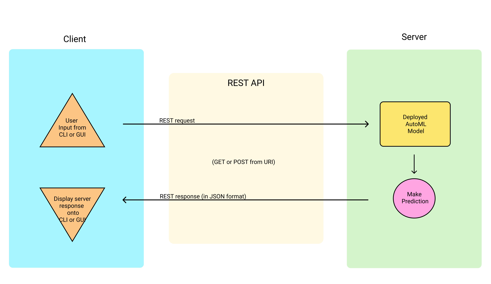
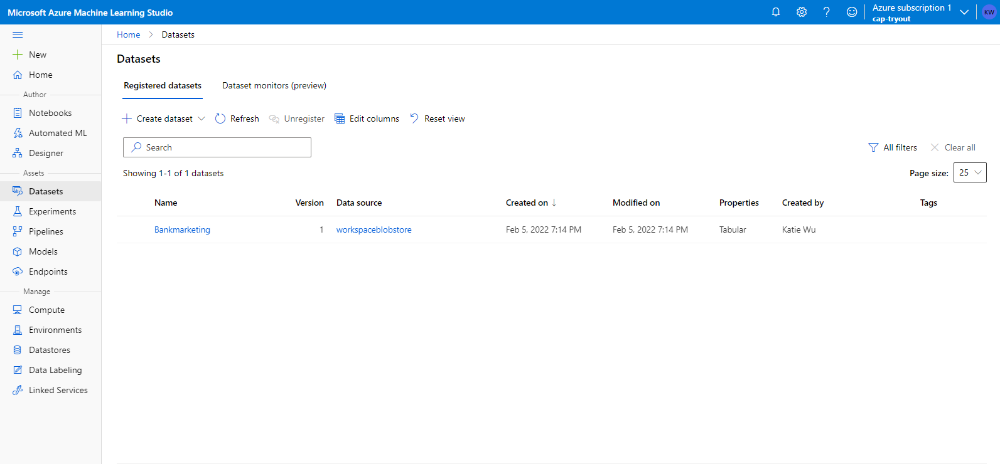
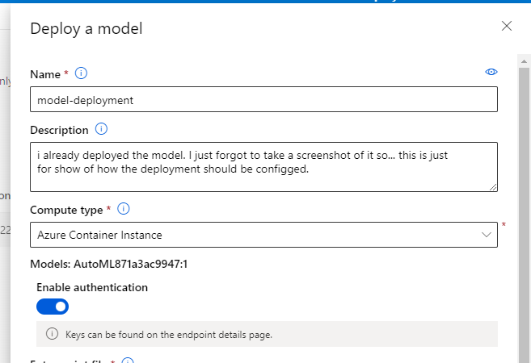

# Bankmarketing 

## Overview of the Project
The purpose of this capstone is to deploy the best model generated by autoML, and make predictions with said model via a published pipeline.

The steps I took to fulfill this objective:

1.) Authenticate my account to access my workspace

2.) Upload the dataset, and create autoML experiment

4.) Deploy the best model 

5.) Enable logging of model deployment status

6.) Create swagger documentation

7.) Create, publish, and consume pipeline

## Architectural Diagram

This is a very simplified visual representation of how requests and responses are sent when we use the HTTP endpoint. 

1.) A user (client-side) either using a CLI or GUI makes a POST request, inputting all the data required to be fed into the ML model.

2.) That body of information, along with a url (with `/score` endpoint), and a bearer token, is sent to the server.

3.) The server checks if the bearer token is recognized, checks if the url passed is valid, and checks if the information passed is valid to be read. If all is valid, then it asks the model to use the body of input to make a prediction.

4.) The model outputs its prediction in a json format

5.) The json output is sent back to the client as a response, displayed in json format for the user to read (either through their CLI or GUI)

## Key Steps
### 1.) Authentication
 
Before we do any AutoML magic, we should authenticate the user that is using the AzureML workspace and resource group to train and deploy a model. In this capstone project, I authenticated an Azure Portal user (me) through creating a "Service Principal" role with controlled permissions to access specific resources. In my case, the workspace `cap-tryout` and resource group `mleng` is shared to me, with my specific client id (--- whited out ---). 

--------------------------------------------------------

### 2.) AutoML via ML Studio

After the user is authenticated, the next step is to upload a dataset for the AutoML experiement to train on. For this capstone project, I downloaded the bankmarketing.csv locally, and uploaded it via the Azure Portal as a tabular dataset, with `y` as our label.

--------------------------------------------------------

Next is to create a new autoML experiment. After we initiated an autoML experiment with this dataset, we wait for it to finish training. The picture above is a reference of what the AutoML experiment status looks like once it is done training.

---------------------------------------------------------

Along with its completion, the AutoML experiment we just ran usually outputs the best model that yields the best accuracy. In our case, we have Voting Ensemble as our best model, yielding an accuracy of 94.697%.

---------------------------------------------------------

### 3.) Deploy the Best Model

Select the best model, and deploy it. In the screenshot above, I make sure that our compute type is Azure Container Instance, authentication is enabled.

---------------------------------------------------------

### 4.) Enable Logging 

---------------------------------------------------------

We have to enable app insights to `True ` in order to monitor metrics of the model as its deployed to a REST endpoint.

---------------------------------------------------------

### 5.) Swagger Documentation

Ideally, if we were to develop a web service for the model we just deployed, it's good practice to provide API documentation on how to use our model. Swagger is a quick way to get our endpoints documented, along with the request parameters needed in order to yield appropriate responses from the server. 

---------------------------------------------------------

### 6.) Consume Model Endpoint

Just to verify that we can make predictions from our deployed endpoint API endpoint `/score`, we run `endpoint.py` which holds a function to make a request -- with params (url, api_key, headers) -- to our model, and the results from the model comes back as a repsonse (yes or no).

---------------------------------------------------------

### 7.) Create, Publish and Consume a Pipeline

In this project, we created a pipeline to ensure a smoother model deployment process. The pipeline can be created via Azure Portal GUI, or by using the Azure SDK `from azureml.pipeline.core import Pipeline`, and defining the parameters of what our Pipeline should have (description, workspace, steps). After we've defined our Pipeline settings, we then run it with `pipeline_run = experiment.submit(pipeline)`, and use the `azureml.widgets import RunDetails` package to help us visualize the process of the pipeline being executed. The screenshot above indicates that two pipelines have been created, and are currently running. 

----------------------------------------------------------

Once the pipeline has finished, we publish the pipeline to ensure that the pipeline is publicly accessible. In the picture above, we have one pipeline published, with a public HTTP endpoint available for users to make a call with. 

----------------------------------------------------------

This image also verifies that the published pipeline uses the dataset that was used for its model training to make predictions from the HTTP endpoint.

----------------------------------------------------------

The image above shows the overview specs of what the published pipeline is configured with. 

----------------------------------------------------------

The image above shows an azure widget, helping us visualize the duration/process of running the pipeline.

----------------------------------------------------------

The image above shows us the pipelines are on a scheduled run once it has been created.

----------------------------------------------------------

### 8.) Demo It! 
This is the screen recording part, which is linked below!

## Screen Recording
The video was too big to embed onto README.md, or even upload onto the repo. So, the link will have to do 🙃
[Demo Video](https://www.loom.com/share/e6c01c2d11ae4a03850ba439123146c3)

----------------------------------------------------------

## Future Changes to Improve Project
### Fullstack it!: 
A working web app, deployed with the AutoML's saved model, would make the experience of using the ML model better. Creating an interface to input all the required data, as well as an interface to see the output of the results, can help users understand what features are important/required to help the model make its prediction. 

### Error Handling: 
Along with creating an interface, it'd be nice to do error handling in case the user inputs data that wouldn't be recognized by the model. I ran into this problem when I was inputting data locally, where one of the fields did not accept `,` separator. It would be reasonble to account for users who input separators like `,` or `.` on fields that handle numbers or dates so these can be parsed and cleaned before it's inputted into the model.

----------------------------------------------------------

## Standout Suggestions
Nothing magical done in this repo. However -- it'd be neat to build a web app!
An update of this repo may happen in the near future :D
