# Bankmarketing 

The purpose of this capstone is to deploy the best model yielded by autoML, and publish and consume a pipline via a REST endpoint.

## Architectural Diagram

## Key Steps
### 1.) Authentication
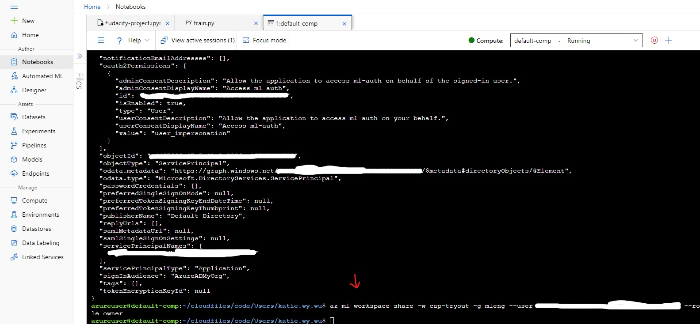 
Before we do any AutoML magic, we should authenticate the user that is using the AzureML workspace and resource group to train and deploy a model. In this capstone project, I authenticated an Azure Portal user (me) through creating a "Service Principal" role with controlled permissions to access specific resources. In my case, the workspace `cap-tryout` and resource group `mleng` is shared to me, with my specific client id (--- whited out ---). 

--------------------------------------------------------

### 2.) AutoML via ML Studio
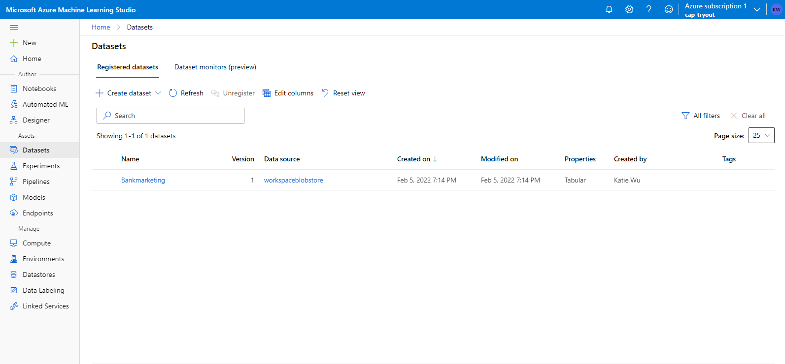
After the user is authenticated, the next step is to upload a dataset for the AutoML experiement to train on. For this capstone project, I downloaded the bankmarketing.csv locally, and uploaded it via the Azure Portal as a tabular dataset, with `y` as our label.

--------------------------------------------------------

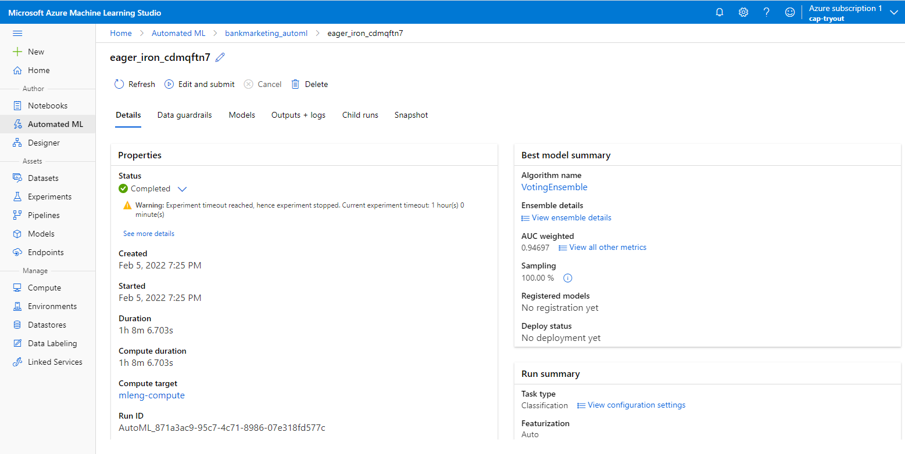
Next is to create a new autoML experiment. After we initiated an autoML experiment with this dataset, we wait for it to finish training. The picture above is a reference of what the AutoML experiment status looks like once it is done training.

---------------------------------------------------------

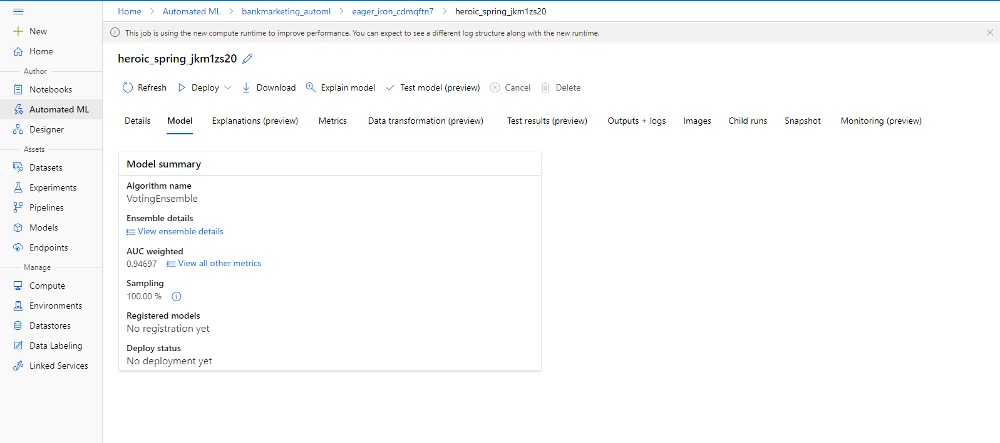
Along with its completion, the AutoML experiment we just ran usually outputs the best model that yields the best accuracy. In our case, we have Voting Ensemble as our best model, yielding an accuracy of 94.697%.

---------------------------------------------------------

### 3.) Deploy the Best Model

Select the best model, and deploy it. In the screenshot above, I make sure that our compute type is Azure Container Instance, authentication is enabled.

---------------------------------------------------------

### 4.) Enable Logging 

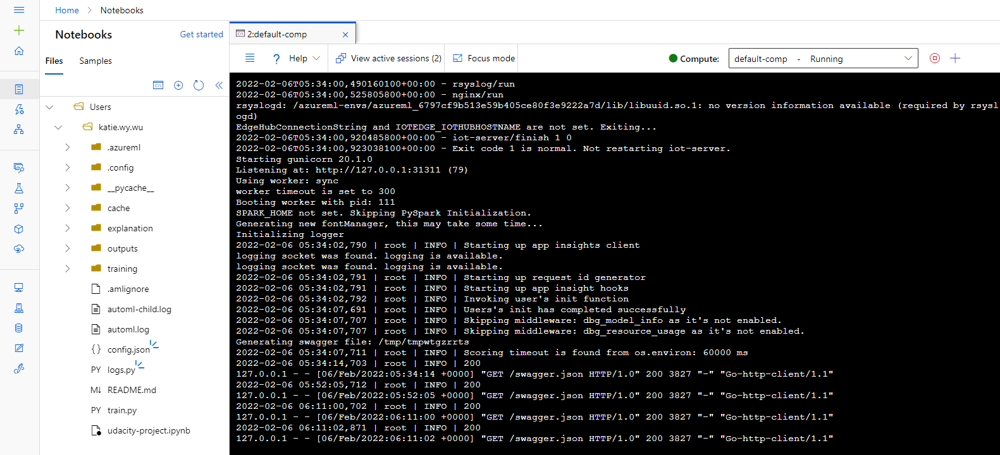

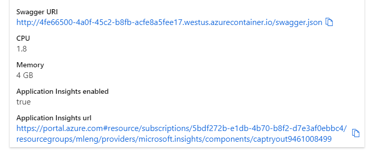
We have to enable app insights here in order for us to monitor metrics of the model as its deployed to a REST endpoint.

### 5.) Swagger Documentation
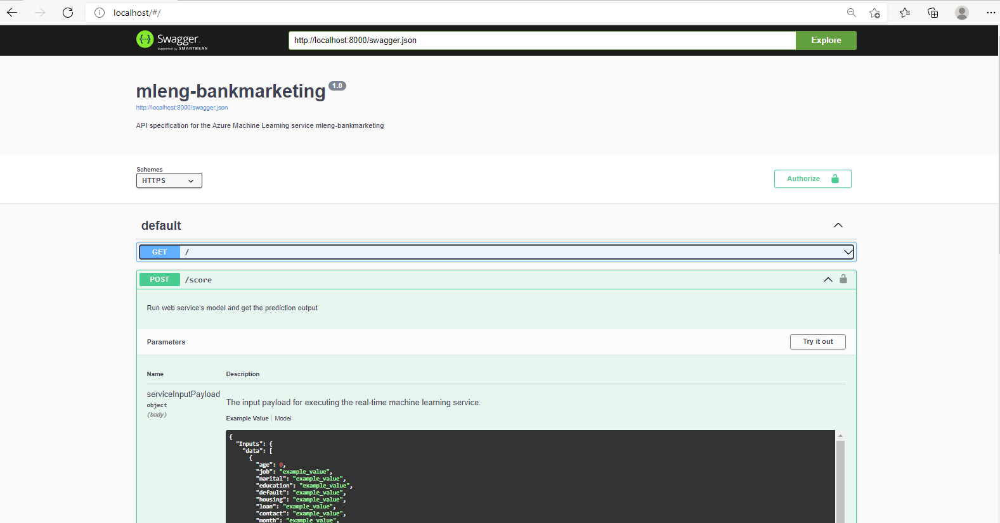
Ideally, if we were to develop a web service for the model we just deployed, it's good practice to provide API documentation on how to use our model. Swagger is a quick way to get our endpoints documented, along with the request parameters needed in order to yield appropriate responses from the server. 

### 6.) Consume Model Endpoint
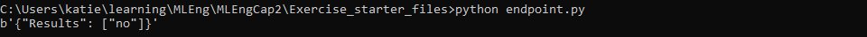
Just to verify that we can make predictions from our deployed endpoint API /score, we run the command (shown above) to ensure that it outputs a result (yes or no).

### 7.) Create, Publish and Consume a Pipeline
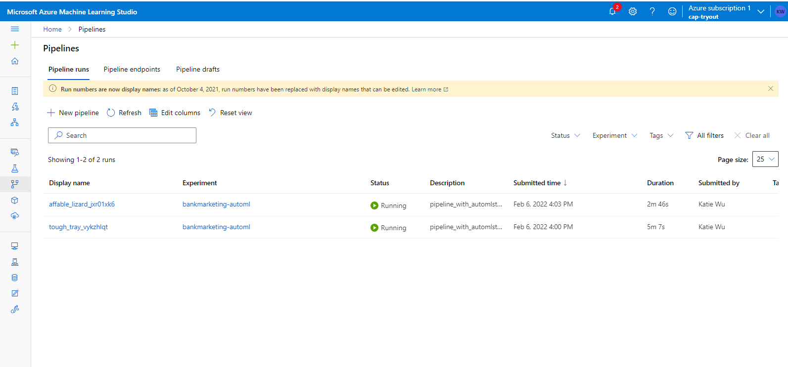

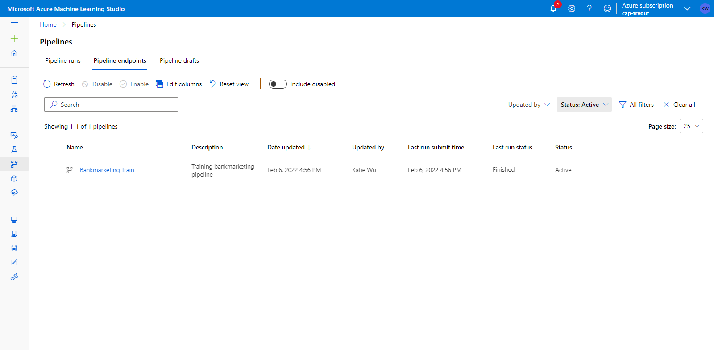

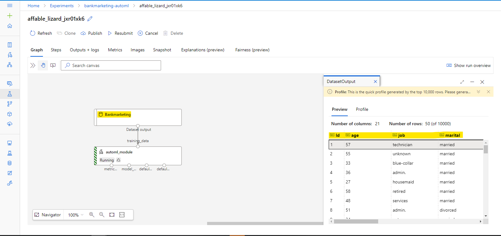

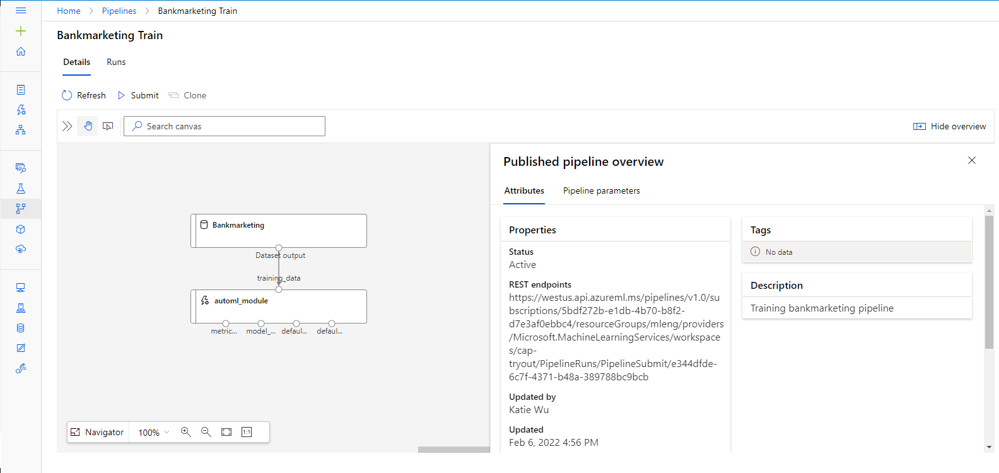

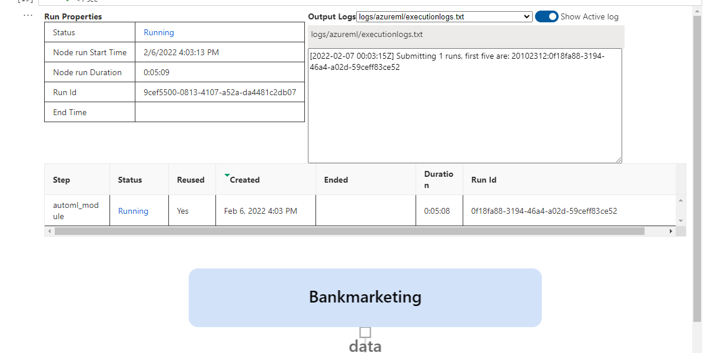

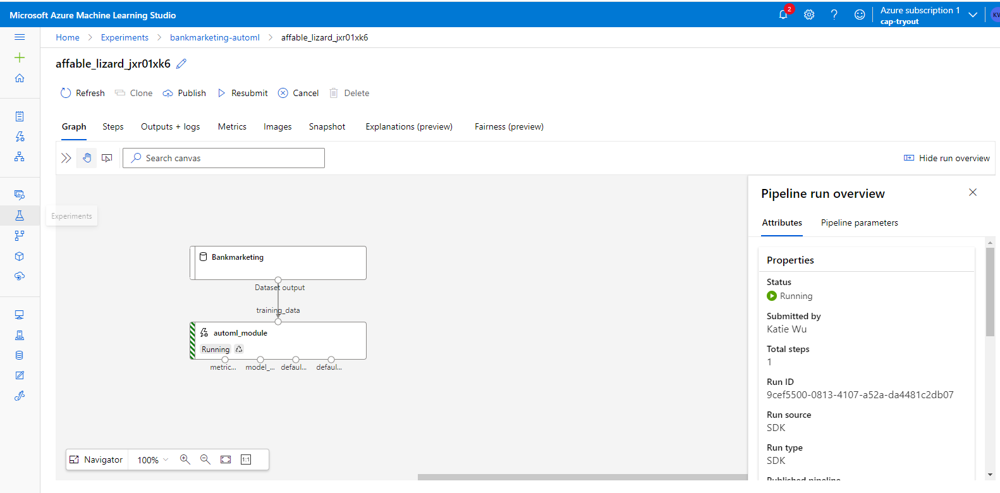

### 8.) Demo It! 
This is the screen recording part, which is linked below!

## Screen Recording

## Standout Suggestions
Nothing outstanding done in this capstone repo. However -- it'd be neat to build a web app with this :D 
I may revamp this repo in the future with this update.